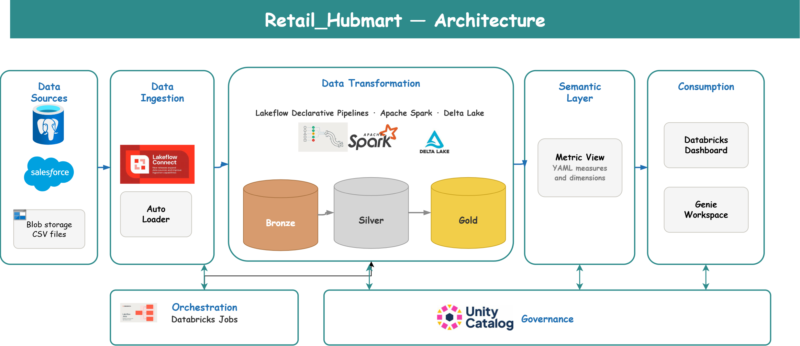
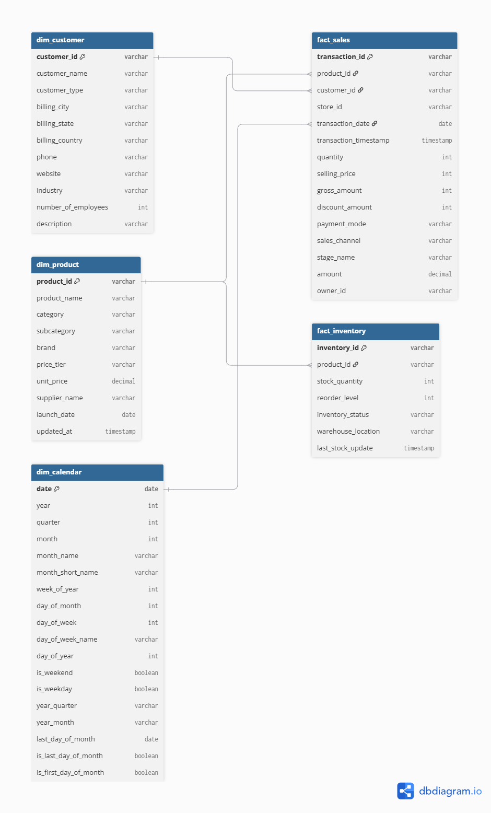
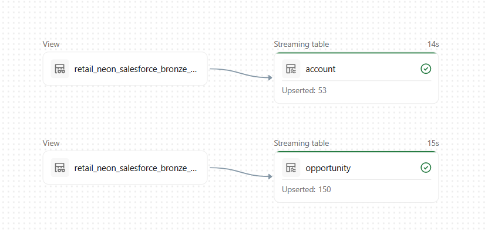
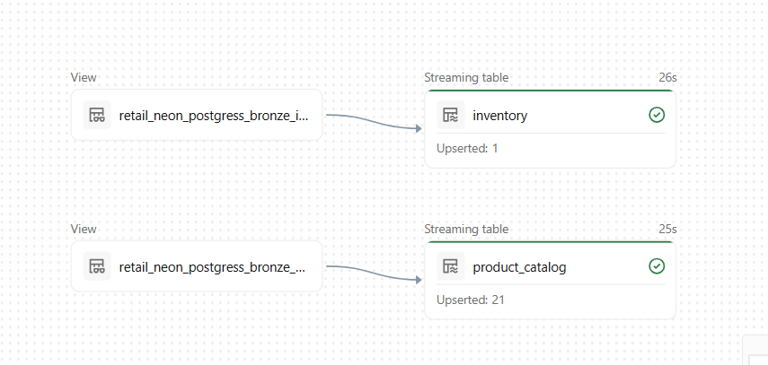
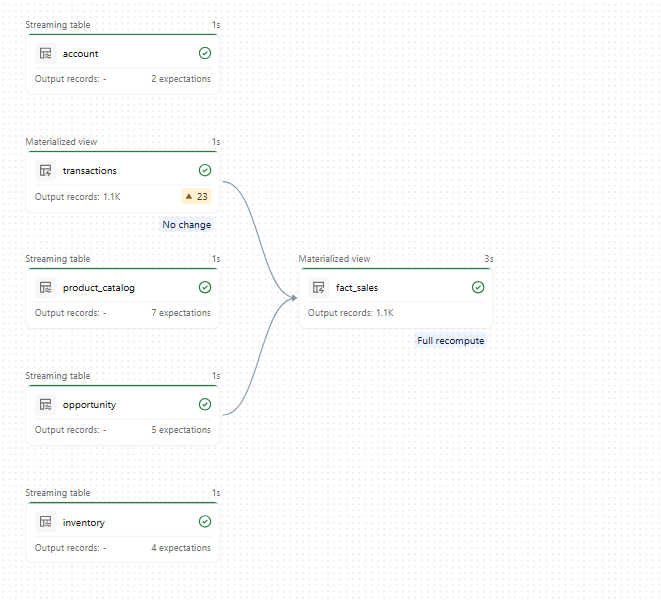
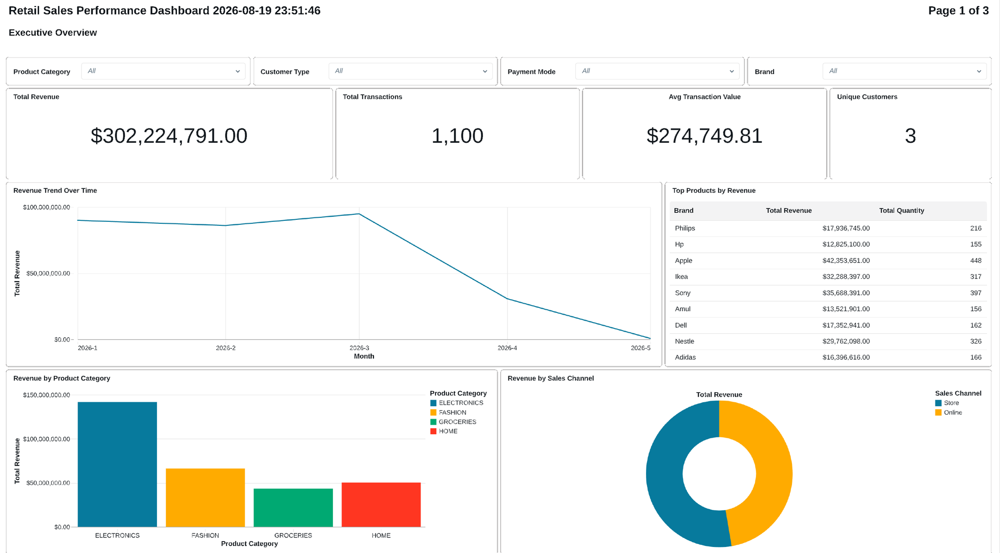
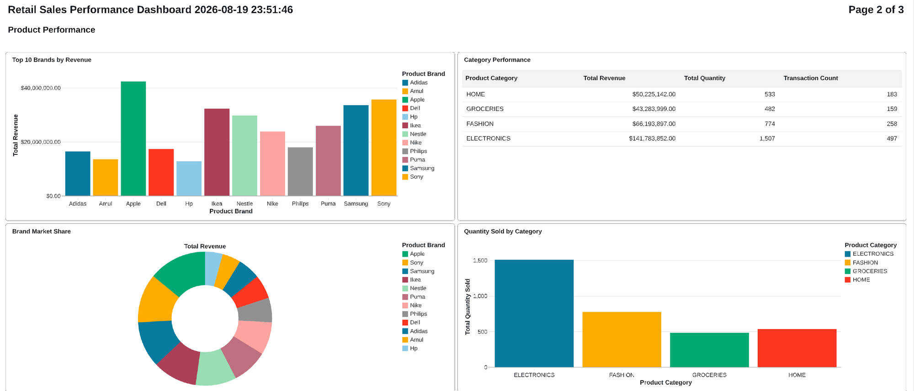
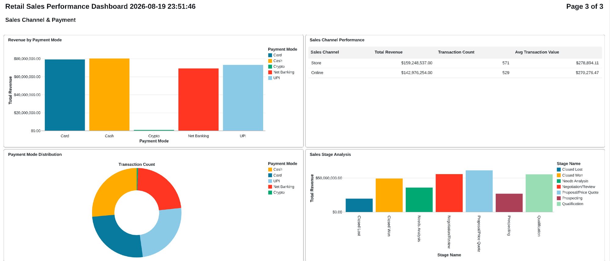

# Retail-Lakehouse-Databricks

## Purpose
This data pipeline unifies retail sales, customer, product, and inventory data from three separate operational systems into a single analytics-ready lakehouse on Databricks. Customer and opportunity records arrive from Salesforce, product catalogue and inventory from PostgreSQL with change data capture, and point-of-sale transactions as CSV files landing in blob storage. Each source is ingested with the pattern that suits it, refined through a medallion architecture using Lakeflow Declarative Pipelines with enforced data quality expectations, and modelled into a gold-layer star schema. A metric view sits on top as a governed semantic layer, so business measures are defined once and consumed consistently by dashboards and natural-language queries.

## Architecture


## Data Flow
1. **Salesforce Ingestion:** Account and opportunity objects land in `salesforce_bronze` as streaming tables.
2. **PostgreSQL Ingestion:** Product catalogue and inventory land in `postgress_bronze` with SCD Type 2 history maintained by CDC.
3. **File Ingestion:** Transaction CSVs are picked up incrementally from a Unity Catalog volume by Auto Loader and written to `blob_bronze`.
4. **Silver Refinement:** Each entity is cleaned, standardised, and validated against declared expectations before landing in `retail_silver`.
5. **Gold Modelling:** A sales fact table is built by joining transactions to opportunities; dimensions are exposed as views over silver.
6. **Semantic Layer:** A metric view defines dimensions and measures in YAML over the gold star schema.
7. **Consumption:** A three-page AI/BI dashboard and Genie natural-language querying read from the metric view rather than the underlying tables.

## Technologies Used
- **Databricks:** Lakehouse platform hosting the entire solution.
- **Lakeflow Declarative Pipelines:** Declarative transformation framework with built-in data quality expectations and lineage.
- **Auto Loader:** Incremental file ingestion with schema inference and evolution.
- **Delta Lake:** Storage format providing ACID guarantees and CDC support.
- **Unity Catalog:** Three-level namespace, volumes, and governance across all layers.
- **PySpark:** Transformation logic across bronze to silver and silver to gold.
- **Metric Views:** YAML-defined semantic layer over the gold star schema.
- **Databricks AI/BI Dashboards:** Reporting layer with Genie natural-language querying.

## Data Model

The gold layer follows a star schema, with dimensions exposed as views over silver and the fact table materialised.

| Object | Type | Grain | Source |
| --- | --- | --- | --- |
| `retail_gold.fact_sales` | Table | Transaction line | Silver transactions joined to opportunities |
| `retail_gold.fact_inventory` | View | Inventory record | Silver inventory |
| `retail_gold.dim_customer` | View | Customer | Silver account, active and non-deleted only |
| `retail_gold.dim_product` | View | Product | Silver product catalogue, active records only |
| `retail_gold.calendar` | Table | Day | Generated date spine |



## ETL Pipeline
The pipeline consists of the following key tasks:

1. **Multi-source ingestion:** Three different bronze patterns, one per source system.
2. **Silver refinement:** Standardisation and declared quality expectations per entity.
3. **Gold modelling:** Fact table construction and dimension views.
4. **Semantic definition:** Metrics and dimensions declared once in YAML.

### Bronze — managed connector ingestion
Salesforce accounts and opportunities are ingested by Lakeflow Connect as streaming tables, with upserts applied on each run
Product catalogue and inventory arrive from PostgreSQL through a CDC connection, with SCD Type 2 history maintained automatically.
<table>
<tr>
<td width="50%"></td>
<td width="50%"></td>
</tr>
<tr>
<td align="center"><em>Salesforce — Lakeflow Connect</em></td>
<td align="center"><em>PostgreSQL — CDC with SCD Type 2</em></td>
</tr>
</table>

### Bronze — Auto Loader for transaction files

Transaction CSVs land in a Unity Catalog volume. Auto Loader tracks which files have already been processed, so only new arrivals are read on each run.

```python
source_path  = "/Volumes/retail_neon/files/blob_storage/transaction_source/"
target_table = "retail_neon.blob_bronze.transactions"

df = (spark.readStream
  .format("cloudFiles")
  .option("cloudFiles.format", "csv")
  .option("header", "true")
  .option("cloudFiles.inferColumnTypes", "true")
  .option("cloudFiles.schemaLocation",
          "/Volumes/retail_neon/files/blob_storage/_schemas/transactions")
  .load(source_path)
)

query = (df.writeStream
  .format("delta")
  .option("checkpointLocation",
          "/Volumes/retail_neon/files/blob_storage/_checkpoints/transactions")
  .trigger(availableNow=True)
  .toTable(target_table)
)

query.awaitTermination()
```

`trigger(availableNow=True)` processes everything currently waiting and then stops, which gives incremental semantics on a scheduled job rather than a continuously running cluster.

### Silver — Salesforce account

Salesforce trial and demo data ships with "(Sample)" in the name and would otherwise inflate every customer count. Expectations are declared as decorators: `expect_or_drop` removes offending rows, while `expect` records a violation without dropping.

```python
from pyspark import pipelines as dp
from pyspark.sql import functions as F

@dp.table(
    name="retail_neon.retail_silver.account",
    comment="Salesforce account data with core business columns and data quality checks"
)
@dp.expect_or_drop("non-null id", "id IS NOT NULL")
@dp.expect("non-null name", "customer_name IS NOT NULL")
def account_cleaning():
    source_df = spark.readStream.table("retail_neon.salesforce_bronze.account")

    filtered_df = source_df.filter(~F.col("Name").contains("(Sample)"))

    return filtered_df.select(
        F.col("Id").alias("id"),
        F.upper(F.trim(F.col("Name"))).alias("customer_name"),
        F.col("Type").alias("type"),
        F.col("BillingCity").alias("billing_city"),
        F.col("BillingState").alias("billing_state"),
        F.col("BillingCountry").alias("billing_country"),
        F.coalesce(F.col("Industry"), F.lit("UNKNOWN")).alias("industry"),
        F.col("NumberOfEmployees").alias("number_of_employees"),
        # __END_AT is null on the current version of an SCD Type 2 record
        F.when(F.col("__END_AT").isNull(), True).otherwise(False).alias("is_active")
    )
```

Deriving `is_active` from the CDC `__END_AT` column turns SCD Type 2 history into a simple boolean filter for downstream consumers, without discarding the history itself.

### Silver — Product catalogue

The product catalogue arrives from PostgreSQL with inconsistent casing and whitespace, and no price banding. Standardisation and the derived tier happen here so every consumer sees the same values.

```python
@dp.table(name="retail_neon.retail_silver.product_catalog")
@dp.expect_or_drop("valid_product_id", "product_id IS NOT NULL AND product_id != ''")
@dp.expect_or_drop("valid_unit_price", "unit_price IS NOT NULL AND unit_price >= 0")
def product_catalog():
    return (
        spark.readStream.table("retail_neon.postgress_bronze.product_catalog")
        .select(
            F.upper(F.trim(F.col("product_id"))).alias("product_id"),
            F.initcap(F.trim(F.col("product_name"))).alias("product_name"),
            F.upper(F.trim(F.col("category"))).alias("category"),

            F.when(F.col("subcategory").isNotNull(),
                   F.upper(F.trim(F.col("subcategory"))))
             .otherwise(F.lit("UNKNOWN")).alias("subcategory"),

            F.round(F.col("unit_price"), 2).alias("unit_price"),

            # Price banding, derived once here rather than in each report
            F.when(F.col("unit_price") < 10,  "BUDGET")
             .when(F.col("unit_price") < 50,  "STANDARD")
             .when(F.col("unit_price") < 200, "PREMIUM")
             .otherwise("LUXURY").alias("price_tier"),

            F.col("__START_AT").alias("start_at"),
            F.col("__END_AT").alias("end_at"),
            F.when(F.col("__END_AT").isNull(), F.lit(True))
             .otherwise(F.lit(False)).alias("is_active"),

            F.current_timestamp().alias("processed_at")
        )
    )
```

### Silver — Transactions

Transaction expectations encode real business rules rather than only null checks. Payment mode is constrained to a known set, so a new or misspelled value surfaces as a quality violation instead of quietly creating a new category in every report.

```python
@dp.table(name="retail_neon.retail_silver.transactions")
@dp.expect_or_drop("non-null transaction_id", "transaction_id IS NOT NULL")
@dp.expect("valid quantity", "quantity > 0")
@dp.expect("valid selling_price", "selling_price >= 0")
@dp.expect("valid payment_mode",
           "payment_mode IN ('UPI','Card','Cash','Net Banking')")
def transactions_clean():
    source_df = spark.read.table("retail_neon.blob_bronze.transactions")

    return source_df.select(
        F.col("transaction_id"),
        F.col("opportunity_name"),
        F.col("product_id"),
        F.col("store_id"),
        F.col("quantity").cast("int"),
        F.col("selling_price").cast("int"),
        (F.col("quantity").cast("int") * F.col("selling_price").cast("int"))
            .alias("gross_amount"),
        F.col("discount_amount").cast("int"),
        F.to_timestamp(F.col("transaction_timestamp"),
                       "dd-MMM-yyyy hh.mm.ss a").alias("transaction_timestamp"),
        F.col("payment_mode"),
        F.col("sales_channel")
    )
```

The source timestamp format (`dd-MMM-yyyy hh.mm.ss a`) is non-standard and would parse to null under a default cast, so the format is declared explicitly.

### Silver — Inventory

Stock status is derived by comparing on-hand quantity against the reorder level, so replenishment reporting needs no threshold logic of its own.

```python
F.when(
    F.col("stock_quantity") < F.col("reorder_level"), "LOW_STOCK"
).otherwise("HEALTHY").alias("inventory_status")
```

### Gold — Sales fact

Transactions carry an opportunity name rather than an opportunity key, so the join is made on a normalised name. A left join preserves transactions that have no matching opportunity rather than dropping revenue from the fact table.

```python
@dp.table(name="retail_neon.retail_gold.fact_sales")
def fact_sales():
    transactions_df = spark.read.table("retail_neon.retail_silver.transactions")
    opportunity_df  = spark.read.table("retail_neon.retail_silver.opportunity")

    joined_df = transactions_df.alias("t").join(
        opportunity_df.alias("o"),
        upper(trim(transactions_df.opportunity_name)) == upper(trim(opportunity_df.name)),
        how="left"
    )

    return joined_df.select(
        "t.transaction_id", "t.product_id", "t.store_id",
        "t.quantity", "t.selling_price", "t.discount_amount",
        "t.transaction_timestamp",
        col("t.transaction_timestamp").cast("date").alias("transaction_date"),
        "t.payment_mode", "t.sales_channel",
        "o.stage_name", "o.owner_id", "o.amount",
        col("o.account_id").alias("customer_id")
    )
```

### Gold — Dimension views

Dimensions are views rather than tables, so they stay current with silver automatically and cost no additional storage. The filters are where the business rules live.

```sql
CREATE OR REPLACE VIEW retail_neon.retail_gold.dim_customer AS
SELECT
    id AS customer_id,
    customer_name,
    type AS customer_type,
    billing_city, billing_state, billing_country,
    phone, website,
    industry, number_of_employees, description
FROM retail_neon.retail_silver.account
WHERE is_deleted = false AND is_active = true;
```

```sql
CREATE OR REPLACE VIEW retail_neon.retail_gold.dim_product AS
SELECT
    product_id, product_name, category, subcategory,
    brand, price_tier, unit_price, supplier_name,
    launch_date, updated_at
FROM retail_neon.retail_silver.product_catalog
WHERE is_active = true;
```

### Gold — Calendar

A parameterised date spine generated with `sequence` and `explode`, carrying the derived attributes reporting needs.

```sql
CREATE OR REPLACE TABLE retail_neon.retail_gold.calendar AS
WITH date_range AS (
  SELECT explode(sequence(
    to_date(:start_date), to_date(:end_date), interval 1 day
  )) AS date
)
SELECT
  date,
  year(date) AS year,
  quarter(date) AS quarter,
  date_format(date, 'MMMM') AS month_name,
  weekofyear(date) AS week_of_year,
  date_format(date, 'EEEE') AS day_of_week_name,
  CASE WHEN dayofweek(date) IN (1, 7) THEN TRUE ELSE FALSE END AS is_weekend,
  concat(year(date), '-Q', quarter(date)) AS year_quarter,
  date_format(date, 'yyyy-MM') AS year_month,
  last_day(date) AS last_day_of_month
FROM date_range
ORDER BY date;
```

### Semantic Layer — Metric view

The metric view defines joins, dimensions, and measures once in YAML. Consumers query it directly, so "Total Revenue" cannot be computed three different ways in three different dashboards.

```sql
CREATE OR REPLACE VIEW retail_neon.retail_semantics.retail_metrics
WITH METRICS
LANGUAGE YAML
AS $$
version: 1.1
source: retail_neon.retail_gold.fact_sales

joins:
  - name: product
    source: retail_neon.retail_gold.dim_product
    on: source.product_id = product.product_id
  - name: calendar
    source: retail_neon.retail_gold.dim_calendar
    on: source.transaction_date = calendar.date
  - name: customer
    source: retail_neon.retail_gold.dim_customer
    on: source.customer_id = customer.customer_id

dimensions:
  - name: Product Category
    expr: product.category
    synonyms: [category]
  - name: Payment Mode
    expr: source.payment_mode
    synonyms: [payment method, payment type]

measures:
  - name: Total Revenue
    expr: SUM(amount)
    format:
      type: currency
      currency_code: USD
  - name: Average Transaction Value
    expr: SUM(amount) / COUNT(1)
  - name: Unique Customers
    expr: COUNT(DISTINCT customer.customer_id)
$$
```

The `synonyms` entries are what make natural-language querying work — a user asking about "payment method" or "category" resolves to the correct dimension without knowing the column names.

## Pipeline Execution
The transformation pipeline runs as a single Lakeflow job. Declaring table dependencies rather than execution order lets the platform derive the DAG and resolve the correct sequence automatically.



The run view also surfaces the quality expectations in force on each table — two on accounts, five on opportunities, seven on the product catalogue, four on inventory — and flags violations. The 23 flagged records on transactions are rows failing a warn-level expectation: they are retained and visible rather than silently dropped.

Note that `transactions` and `fact_sales` are materialised views while the other four are streaming tables, which is why the run reports a full recompute for `fact_sales` rather than an incremental update.

## Dashboard
A three-page Databricks AI/BI dashboard reads the gold layer, with cross-filtering on product category, customer type, payment mode, and brand.

**Executive Overview** — headline KPIs for revenue, transaction count, average transaction value, and unique customers, alongside a monthly revenue trend, top brands by revenue, and revenue split by product category and sales channel.



**Product Performance** — top brands ranked by revenue, brand market share, category performance with revenue, quantity and transaction counts, and quantity sold by category.



**Sales Channel & Payment** — revenue and transaction distribution across payment modes, store versus online channel performance, and revenue by opportunity stage, which links point-of-sale activity back to the Salesforce pipeline.



The dashboard is Genie-enabled, so users can ask questions in natural language against the same governed definitions. The `synonyms` declared in the metric view are what allow a question phrased as "which brand sold the most" to resolve to the correct dimension without the user knowing the column names.

## Repository Structure
```
retail-lakehouse/
├── ingestion/
│   └── blob_bronze.py                    # Auto Loader — CSV to bronze
├── bronze_to_silver/
│   ├── account.py                        # Salesforce accounts
│   ├── opportunities.py                  # Salesforce opportunities
│   ├── product_transformation.py         # Postgres product catalogue
│   ├── inventory.py                      # Postgres inventory
│   └── transaction.py                    # Blob transactions
├── silver_gold/
│   ├── fact_sales.py                     # Sales fact table
│   ├── gold_views.py                     # Dimension views
│   └── calendar.py                       # Date spine
├── semantics/
│   └── metric_view.py                    # YAML metric definitions
├── docs/
│   └── images/
└── README.md
```

## Development Setup
To run this pipeline in your own workspace:

- Provision a Databricks workspace with Unity Catalog enabled and create the `retail_neon` catalog.
- Create the schemas: `salesforce_bronze`, `postgress_bronze`, `blob_bronze`, `retail_silver`, `retail_gold`, `retail_semantics`.
- Configure a Salesforce connection to land `account` and `opportunity` into `salesforce_bronze`.
- Configure a PostgreSQL CDC connection to land `product_catalog` and `inventory` into `postgress_bronze` with SCD Type 2 enabled.
- Create a volume at `/Volumes/retail_neon/files/blob_storage/` and point the transaction source folder at it.
- Run `blob_bronze.py` to establish the Auto Loader stream.
- Create a Lakeflow Declarative Pipeline over the `bronze_to_silver` and `silver_gold` folders.
- Run `calendar.py` with `start_date` and `end_date` parameters covering the transaction date range.
- Create the gold views and the metric view.
- Build the AI/BI dashboard against the metric view and enable Genie on it.

## Design Notes
- **One ingestion pattern per source.** Salesforce and PostgreSQL arrive as managed connector streams; files use Auto Loader. Each pattern suits its source rather than forcing all three through one mechanism.
- **Expectations as contracts.** Constraining `payment_mode` and `stage_name` to known value sets means an unexpected value is reported as a quality violation instead of silently appearing as a new category in downstream reports.
- **Drop versus warn.** `expect_or_drop` is reserved for rows that would break joins, such as null primary keys. `expect` is used for values that are suspect but still worth keeping visible.
- **Dimensions as views.** No storage cost, no refresh to schedule, and always consistent with silver. The fact table is materialised because the join is expensive enough to be worth persisting.
- **Semantic layer over the star schema.** Defining measures once in the metric view prevents the common failure where each dashboard computes revenue slightly differently.
